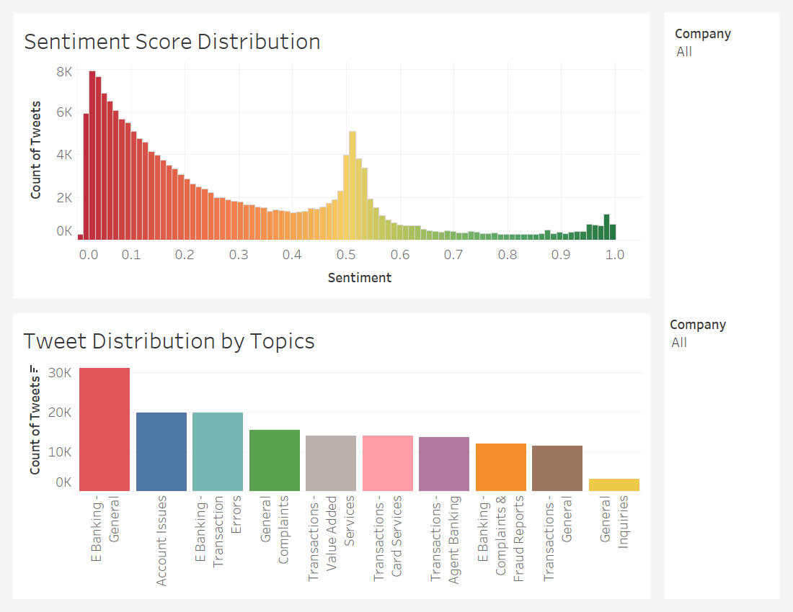
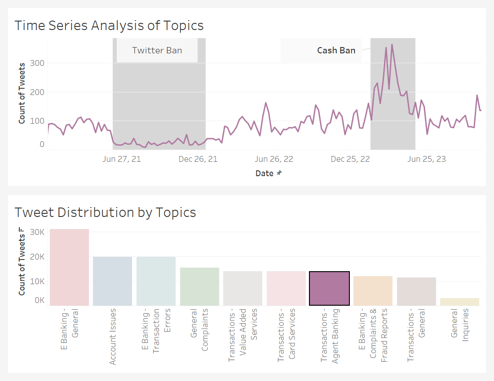

# Social Media Customer Observability Pipeline

## Project Overview

This repository contains the Social Media Customer Observability Pipeline project, 
which aims to enable companies to leverage social media data to understand and visualize customer discussions and sentiments.
The pipeline is applied to an illustrative example 
of generating insights from social media posts
about the top Nigerian banks.

## Objective

For the illustrative example, the project's goal is to build a pipeline that:
- Extracts insights from the social media interactions of banking customers.
- Categorizes posts into topics and analyzes sentiment.
- Visualizes the derived insights in real-time using Tableau.

## Pipeline Process

The pipeline encompasses several steps:
1. **Data Collection**: Scraping around 485K raw tweets.
2. **Data Preprocessing**: Refining the dataset to approximately 185K usable tweets.
3. **Topic Modeling**: Implementing machine learning to categorize tweets into 10 distinct topics.
4. **Sentiment Analysis**: Utilizing Cardiff NLP’s RoBERTa-based sentiment model for mood prediction.

## Tech Stack

The pipeline utilizes the following technologies:
- **Data Extraction**: [Twitter Web Scraper](https://github.com/bocchilorenzo/ntscraper) 
- **Data Transformation and Loading**: Pandas, SQLAlchemy
- **Database Management**: PostgreSQL
- **Topic Modeling Training**: Scikit-Learn, Gensim
- **Sentiment Analysis Modeling**: HuggingFace Transformers
- **Data Visualization**: Tableau

## Insights and Trends

Key insights:
- A substantial focus on electronic banking issues.
- A prevalent negative sentiment across customer tweets.
- Notable trends, such as increased interest in third-party agent banking during specific periods.

## License

This project is licensed under the MIT License - see the [LICENSE](LICENSE.md) file for details.

## Acknowledgements

- Cardiff NLP for the sentiment analysis model.
- Tableau Software for visualization capabilities.
- The open-source contributors of the utilized libraries.

